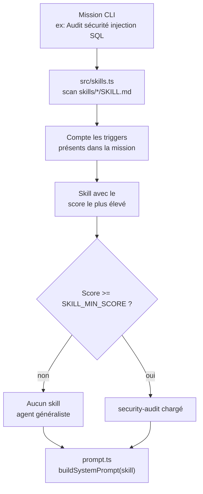
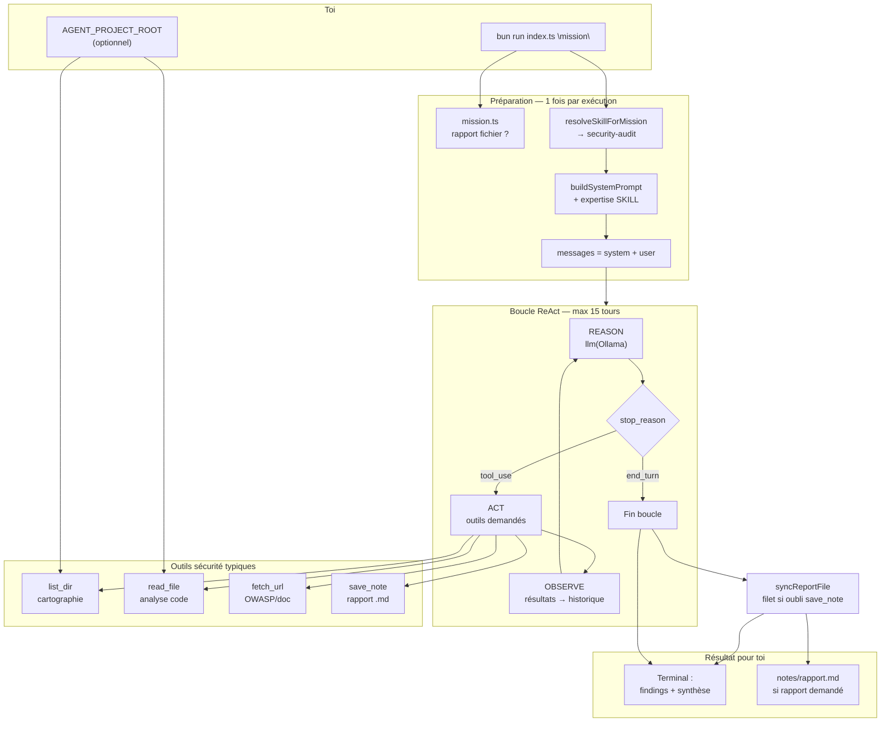
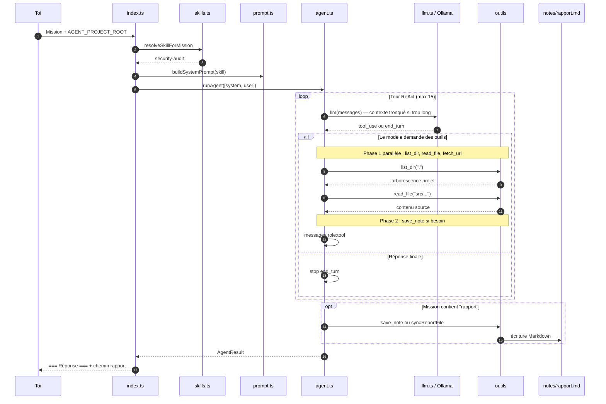
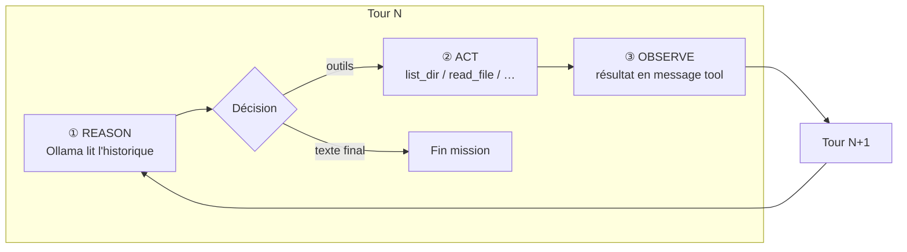

# GuideSecurity — Agent d’audit sécurité

Guide complet de l’**agent sécurité** intégré à **agent-harness** : ce qui a été construit, comment l’utiliser, et le parcours complet jusqu’au rapport de findings.

Voir aussi : [docs/AGENT-SECURITE.md](docs/AGENT-SECURITE.md) (référence rapide).

---

## 1. Qu’est-ce que cet « agent sécurité » ?

Ce n’est pas un produit séparé : c’est **agent-harness** configuré pour des missions sécurité via :

| Brique | Fichier | Rôle |
|--------|---------|------|
| **Skill** | `skills/security-audit/SKILL.md` | Méthode OWASP, checklist injections, format du rapport |
| **Outils** | `read_file`, `list_dir` | Lire le **code de ton projet** (routes, SQL, templates, config) |
| **Outils existants** | `fetch_url`, `save_note`, `run_js` | Doc OWASP/CVE ; rapport fichier ; calculs (limité) |
| **Détection auto** | `src/skills.ts` | Charge le skill si la mission contient les bons mots-clés |
| **Boucle ReAct** | `agent.ts` + `llm.ts` | Raisonne → appelle outils → observe → recommence |

**Objectif** : trouver failles et axes d’amélioration (injection SQL/JS/XSS, secrets, auth, headers, etc.) pour **sécuriser au maximum** ton site ou repo dans le périmètre analysé.

**Ce n’est pas** : un pentest actif sur URL de production, un scanner commercial, ni une garantie « zéro faille ».

---

## 2. Ce qui a été fait (résumé technique)

### 2.1 Skill `security-audit`

- Nouveau dossier `skills/security-audit/` avec frontmatter YAML (**triggers**).
- Contenu injecté dans le **system prompt** (pas dans le message utilisateur).
- Méthode en 5 étapes : périmètre → recon → analyse fichiers → patterns → synthèse.
- Format de sortie : **Critique / Élevé / Moyen / Faible** + axes de durcissement + checklist.
- Règles : ne pas recopier de vrais secrets ; citer fichier:ligne ; pas d’exploit actif sur prod.

### 2.2 Outils pour scanner le projet

| Outil | Fonction | Sécurité |
|-------|----------|----------|
| `list_dir(path)` | Liste fichiers/dossiers (`.`, `src`, `api`…) | Exclut `node_modules`, `.git` |
| `read_file(path)` | Lit un fichier (max ~12 000 car.) | Chemins **relatifs** uniquement |
| `fetch_url(url)` | Doc web (OWASP, CVE) | Bloque localhost / IP privées |
| `save_note(content)` | Rapport Markdown | Si mission demande un **rapport** |
| `run_js(code)` | Calculs | Optionnel (`AGENT_ALLOW_RUN_JS`) |

### 2.3 Garde des chemins (`src/path-guard.ts`)

- Toute lecture passe par `PROJECT_ROOT` (défaut : dossier du harness).
- Interdit `../../../etc/passwd` (path traversal).
- Variable **`AGENT_PROJECT_ROOT`** pour auditer **un autre projet** (ton site).

### 2.4 Séparation avec `code-review`

- Les triggers **sécurité / injection / owasp / faille** sont sur **security-audit**.
- **code-review** reste pour PR, qualité, refactor (sans voler les missions sécu).

### 2.5 Intégration harness existant

- Outils enregistrés dans `src/tool-registry.ts` (schéma Ollama + prompt + parallélisme).
- `read_file` / `list_dir` exécutables **en parallèle** dans un même tour (comme `fetch_url`).
- Tests : `skills.test.ts`, `tools.test.ts`, `path-guard.test.ts`.

---

## 3. Comment l’agent est choisi (skill)



**Exemples de missions → skill :**

| Mission | Skill chargé |
|---------|----------------|
| `Audit sécurité injection SQL et XSS` | **security-audit** |
| `Sécuriser mon site au maximum` | **security-audit** |
| `Fais une code review de cette PR` | **code-review** |
| `Calcule 10*10` | *(aucun)* |

---

## 4. Schéma complet : de ta mission au résultat

### 4.1 Vue d’ensemble (pipeline)



### 4.2 Séquence détaillée (chronologie)



### 4.3 Un tour ReAct (zoom)



L’agent **ne voit pas tout le repo d’un coup** : il explore par étapes (comme un auditeur humain), lit des fichiers ciblés, puis synthétise.

---

## 5. Comment utiliser l’agent sécurité

### 5.1 Prérequis

```bash
bun install
ollama pull llama3.2
# Recommandé pour de meilleurs résultats sécu :
# ollama pull qwen2.5:7b
```

Ollama doit tourner (`http://localhost:11434`).

### 5.2 Auditer le harness (test)

```bash
bun run index.ts "Audit sécurité : injections SQL, XSS, secrets, headers HTTP, OWASP"
```

### 5.3 Auditer **ton site / ton repo** (cas réel)

**PowerShell :**

```powershell
$env:AGENT_PROJECT_ROOT = "C:\chemin\vers\mon-site"
$env:OLLAMA_MODEL = "qwen2.5:7b"
bun run index.ts "Audit sécurité complet de mon projet : SQL injection, XSS, CSRF, auth, secrets exposés"
```

**Avec rapport fichier** (`notes/rapport.md` dans le dossier du harness) :

```powershell
$env:AGENT_PROJECT_ROOT = "C:\chemin\vers\mon-site"
bun run index.ts "Audit sécurité de mon site et rédige un rapport structuré avec recommandations"
```

Le mot **rapport** active `save_note` + synchronisation finale.

### 5.4 Exemples de missions efficaces

```
Audit sécurité : trouver failles injection SQL et XSS dans le code

Sécuriser mon site au maximum — OWASP Top 10, secrets, auth, CORS

Audit sécurité API et frontend : IDOR, JWT, rate limiting, headers

Analyse vulnérabilités configuration (CSP, HSTS, cookies) et rédige un rapport
```

### 5.5 Ce que tu obtiens en sortie

**Terminal :**

```
── Détection skill ─────────────
Skill chargé : security-audit

[Tour 1] stop_reason=tool_use | outils: list_dir, read_file
  [outil] list_dir(...) → ...
  [outil] read_file(...) → ...

=== Fin agent (stop_reason=end_turn, tours=4) ===

=== Réponse ===
# Audit sécurité — ...
## Findings
### Critique
...
```

**Fichier** (si rapport demandé) : `notes/rapport.md` — Markdown structuré (findings + axes d’amélioration).

---

## 6. Variables d’environnement

| Variable | Défaut | Usage |
|----------|--------|--------|
| `AGENT_PROJECT_ROOT` | dossier du harness | Racine du **code à auditer** |
| `OLLAMA_HOST` | `http://localhost:11434` | API Ollama |
| `OLLAMA_MODEL` | `llama3.2` | Modèle (un plus capable = meilleur audit) |
| `AGENT_ALLOW_RUN_JS` | activé | `0` pour désactiver `run_js` |

Constantes dans `config.ts` : `MAX_READ_FILE_BYTES`, `MAX_TURNS`, etc.

---

## 7. Ce que l’agent analyse (checklist)

| Risque | Où il cherche (exemples) |
|--------|---------------------------|
| **Injection SQL** | Requêtes concaténées, ORM mal utilisé, raw queries |
| **XSS** | `innerHTML`, templates, React `dangerouslySetInnerHTML` |
| **CSRF** | Formulaires sans token, APIs state-changing |
| **Auth / session** | JWT localStorage, sessions, logout, rate limit |
| **Secrets** | Clés API dans le repo, `.env` commité |
| **Accès** | IDOR, routes admin, CORS `*` |
| **Config** | Headers sécurité, debug prod, HTTPS |
| **Dépendances** | Versions visibles dans `package.json` / lockfile |

Le skill demande de **mapper** vers OWASP (A01–A10) quand c’est pertinent.

---

## 8. Limites à connaître

| Limite | Détail |
|--------|--------|
| Modèle local | Peut rater des failles subtiles → modèle plus gros conseillé |
| Lecture partielle | Fichiers tronqués au-delà de ~12 000 caractères |
| Pas de pentest actif | Pas de fuzzing HTTP sur ta prod par défaut |
| `node_modules` ignoré | Normal — pas d’analyse de toutes les deps |
| Une mission = une passe | Pas de mémoire entre deux lancements CLI |

---

## 9. Fichiers du projet (carte)

```
agent-harness/
├── GuideSecurity.md          ← ce guide
├── index.ts                  ← entrée CLI
├── agent.ts                  ← boucle ReAct
├── llm.ts                    ← Ollama + troncature contexte
├── prompt.ts                 ← system prompt + skill
├── config.ts                 ← PROJECT_ROOT, limites
├── skills/
│   └── security-audit/
│       └── SKILL.md          ← cerveau métier sécurité
├── src/
│   ├── skills.ts             ← détection triggers
│   ├── tool-registry.ts      ← outils exposés au LLM
│   ├── path-guard.ts         ← chemins sûrs
│   └── report/sync.ts        ← rapport fichier final
├── tools.ts                  ← read_file, list_dir, fetch_url…
└── notes/
    └── rapport.md            ← sortie si mission "rapport"
```

---

## 10. Dépannage rapide

| Problème | Piste |
|----------|--------|
| Skill `code-review` au lieu de `security-audit` | Ajoute « audit sécurité » ou « injection » dans la mission |
| `ERREUR: fichier introuvable` | Vérifie `AGENT_PROJECT_ROOT` et le chemin relatif |
| Réponse vague | Modèle faible → change `OLLAMA_MODEL` |
| Pas de `rapport.md` | Ajoute « rapport » ou « rédige un rapport » dans la mission |
| Ollama timeout | Mission trop longue → réduire périmètre ou augmenter timeout dans `config.ts` |

**Tests :**

```bash
bun test
bun run test:skills
```

---

## 11. Évolutions futures (non implémentées)

- `grep_code(regex)` — chercher patterns dangereux dans tout le repo
- Règles JSON type semgrep
- Export SARIF / HTML
- Scan HTTP passif (avec garde-fous stricts)

---

## 12. Récap en une phrase

Tu donnes une **mission sécurité** en CLI → le harness charge **security-audit** → l’agent **explore et lit ton code** via `list_dir` / `read_file` → il **raisonne en boucle ReAct** avec Ollama → tu reçois un **rapport de failles et d’améliorations** (terminal + optionnellement `notes/rapport.md`).

Pour lancer maintenant sur ton projet :

```powershell
$env:AGENT_PROJECT_ROOT = "C:\ton\chemin\projet"
bun run index.ts "Audit sécurité OWASP : SQL injection, XSS, secrets, auth — rédige un rapport"
```
