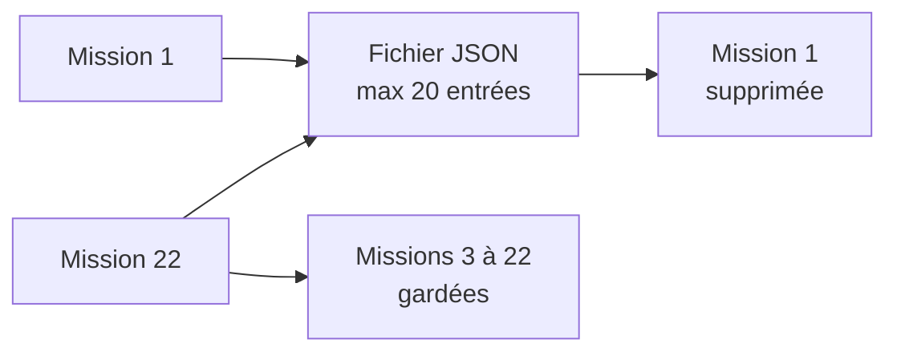
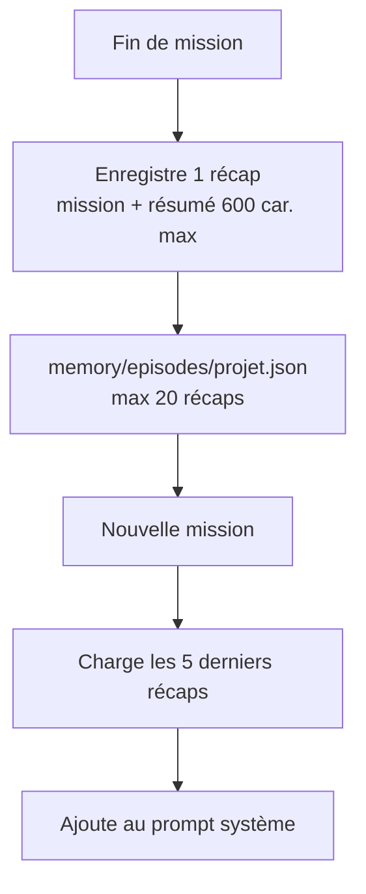

# Rapport — Mémoire de l’agent

Guide simple : **petit récap** de ce que l’agent a fait, **limites de taille**, **suppression automatique** des vieilles missions.

---

## 1. C’est quoi ? (en une phrase)

À la fin de chaque mission, le harness sauvegarde un **mini récap** : ta question + un **extrait court** de la réponse.  
Au prochain lancement (**même projet**), il rappelle les **5 dernières** missions à l’IA — pas tout l’historique des tours.

> **Ce n’est pas** une copie de tout ce qu’il a lu (`read_file`, web, etc.).  
> **C’est** un carnet de bord pour se souvenir de *ce que tu as demandé* et *ce qu’il a conclu*.

---

## 2. Où c’est stocké

```
agent-harness/memory/episodes/<nom-projet>.json
```

Exemple : `memory\episodes\agent-harness.json`

- Fichier **texte JSON** lisible (Bloc-notes / VS Code).
- **Local** sur ton PC — pas dans Ollama, pas dans le cloud.
- Dossier `memory/` ignoré par Git (`.gitignore`).

---

## 3. Limites — la mémoire ne grossit pas sans fin

Tout est plafonné dans `config.ts`. Le disque **ne peut pas** déraper.

| Limite | Valeur | Effet |
|--------|--------|--------|
| **Missions max sur disque** | **20** par projet | À la 21ᵉ mission, la **plus ancienne** est **supprimée automatiquement** |
| **Missions rappelées à l’IA** | **5** (les plus récentes) | Le prompt ne recharge pas les 20 — seulement un rappel court |
| **Résumé par mission** | **600 caractères max** | Extrait de la réponse finale, pas le rapport entier |
| **Texte de ta mission** | **400 caractères max** | Si tu envoies un pavé, seul le début est gardé |
| **Pas stocké** | — | Fichiers lus, logs outils, conversation tour par tour |

### Taille maximale estimée (par projet)

| Élément | Ordre de grandeur |
|---------|-------------------|
| 1 mission (récap) | ~1 à 2 Ko |
| 1 fichier JSON (20 missions max) | **~25 à 40 Ko** |
| 10 projets différents | **~250 à 400 Ko** au total |

Pour comparer : une photo fait souvent **500 Ko à 5 Mo**. La mémoire reste **négligeable**.

Le code calcule une borne haute (~40 Ko par fichier) ; au lancement tu peux voir :

```text
[harness] mémoire mise à jour → ...json (12 mission(s), ~40960 o max)
```

(`~40960 o max` = plafond théorique, pas la taille réelle à chaque fois.)

### Suppression automatique (rotation)



Quand tu dépasses **20** missions sur le **même** projet :

```text
[harness] mémoire : 1 ancienne(s) mission(s) supprimée(s) (max 20 gardées)
```

Tu n’as rien à faire : c’est **automatique**.

---

## 4. Contenu d’un récap (exemple)

Chaque entrée dans le JSON ressemble à :

- **Date** de la mission  
- **Mission** (ta phrase, tronquée si trop longue)  
- **Skill** utilisé (ex. `security-audit`)  
- **Résumé** (~quelques lignes de la réponse finale)  
- **Tours** / statut de fin  

**Exemple de résumé** : *« Audit : 2 risques XSS mineurs sur templates, 1 secret en dur dans config.example… »* — pas les 50 pages de `read_file`.

Les mots de passe / clés type `api_key: xxx` sont **masqués** (`[masqué]`) dans le résumé.

---

## 5. Schéma du fonctionnement



---

## 6. Utilisation

### Mission normale (mémoire active)

```bash
bun run index.ts "Audit sécurité injection SQL"
```

```text
── Mémoire ─────────────────────
Missions précédentes : 3 enregistrée(s), 3 rappelée(s) dans le prompt
```

### Effacer toute la mémoire du projet

```bash
bun run index.ts --forget-memory
```

### Désactiver la mémoire

```powershell
$env:AGENT_MEMORY = "0"
bun run index.ts "Ma mission"
```

### Autre projet (fichier séparé)

```powershell
$env:AGENT_PROJECT_ROOT = "C:\mon-site"
bun run index.ts "Audit sécurité"
```

→ mémoire dans `memory\episodes\` avec un **autre** nom de fichier.

---

## 7. FAQ

| Question | Réponse |
|----------|---------|
| Ça va remplir mon disque ? | **Non** — plafond ~40 Ko par projet, rotation à 20 missions. |
| Les anciennes disparaissent ? | **Oui**, automatiquement après la 20ᵉ (les plus vieilles d’abord). |
| L’IA voit les 20 ? | **Non** — seulement les **5** plus récentes dans le prompt. |
| C’est quoi exactement stocké ? | **Récap** mission + résumé court — pas le code lu en entier. |
| Je peux tout supprimer ? | **Oui** — `--forget-memory` ou supprime `memory/`. |

---

## 8. Réglages (dans `config.ts`)

| Constante | Défaut | Rôle |
|-----------|--------|------|
| `MAX_EPISODES_STORED` | 20 | Missions gardées sur disque |
| `MAX_EPISODES_IN_PROMPT` | 5 | Missions rappelées à l’IA |
| `MAX_MEMORY_SUMMARY_CHARS` | 600 | Taille max du résumé |
| `MAX_MEMORY_MISSION_CHARS` | 400 | Taille max de ta question enregistrée |
| `MEMORY_ENABLED` | oui | `AGENT_MEMORY=0` pour couper |

---

## 9. Résumé

La mémoire = **petits récaps** dans `memory/episodes/*.json`, **rotation à 20**, **rappel de 5** à l’agent, **~40 Ko max par projet** — tu peux lire, supprimer ou désactiver quand tu veux.
