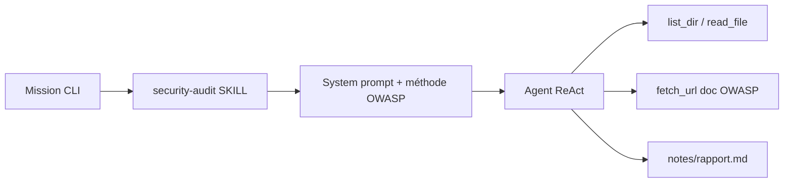

# Agent sécurité — security-audit

Référence rapide. **Guide complet avec schémas** : [GuideSecurity.md](../GuideSecurity.md).

Guide pour auditer la sécurité d’un **site ou projet** avec agent-harness (injections SQL/XSS, OWASP, durcissement).

---

## TODO (réalisé ensemble)

| Étape | Statut | Détail |
|-------|--------|--------|
| 1. Skill `security-audit` | ✅ | `skills/security-audit/SKILL.md` |
| 2. Outils `read_file` + `list_dir` | ✅ | Scan code local sous `PROJECT_ROOT` |
| 3. Garde chemins `path-guard` | ✅ | Pas de `../` hors projet |
| 4. Séparer `code-review` | ✅ | Triggers sécurité → security-audit |
| 5. Tests | ✅ | `skills.test`, `tools.test`, `path-guard.test` |

### Évolutions possibles (plus tard)

- [ ] `grep_code(pattern)` — recherche regex dans le repo
- [ ] `AGENT_PROJECT_ROOT` pointant vers **ton** site (pas le harness)
- [ ] Règles JSON (semgrep-lite) chargées par le skill
- [ ] Rapport HTML / SARIF

---

## Comment ça marche



1. La mission contient des mots-clés (`audit sécurité`, `injection sql`, `xss`, …).
2. Le skill **security-audit** est chargé (score triggers le plus élevé).
3. L’agent **liste** puis **lit** les fichiers du projet.
4. Il produit un rapport structuré (Critique → Faible + axes d’amélioration).

---

## Lancer un audit

### Auditer le harness lui-même (défaut)

```bash
bun run index.ts "Audit sécurité du projet : injections SQL, XSS, secrets, OWASP"
```

### Auditer **ton** site / repo

```bash
set AGENT_PROJECT_ROOT=C:\chemin\vers\mon-site
bun run index.ts "Audit sécurité complet : SQL injection, XSS, auth, headers, secrets"
```

Sous PowerShell :

```powershell
$env:AGENT_PROJECT_ROOT = "C:\chemin\vers\mon-site"
bun run index.ts "Audit sécurité de mon site et rédige un rapport structuré"
```

Le mot **rapport** active `save_note` → `notes/rapport.md`.

---

## Ce que l’agent cherche (résumé)

| Catégorie | Exemples |
|-----------|----------|
| Injection | SQL concat, `eval`, commandes shell, NoSQL |
| XSS | `innerHTML`, templates non échappés, CSP faible |
| Auth | JWT mal géré, sessions, rate limit |
| Secrets | Clés dans le code, `.env` commité |
| Config | CORS `*`, debug prod, headers manquants |
| Accès | IDOR, routes admin exposées |

---

## Limites importantes

- **Pas un pentest actif** sur URL de prod (sauf mission explicite — déconseillé).
- Modèle local (**llama3.2**) : peut manquer des findings subtils → préférer un modèle plus capable si possible (`OLLAMA_MODEL=…`).
- Lecture fichier plafonnée (`MAX_READ_FILE_BYTES` dans `config.ts`).
- `node_modules` / `.git` exclus de `list_dir`.

---

## Variables utiles

| Variable | Rôle |
|----------|------|
| `AGENT_PROJECT_ROOT` | Racine du code à auditer |
| `OLLAMA_MODEL` | Modèle pour meilleure analyse |
| `AGENT_ALLOW_RUN_JS=0` | Désactive `run_js` pendant l’audit |

---

## Fichiers clés

| Fichier | Rôle |
|---------|------|
| `skills/security-audit/SKILL.md` | Méthode + format rapport sécurité |
| `tools.ts` | `read_file`, `list_dir` |
| `src/path-guard.ts` | Chemins sûrs |
| `src/tool-registry.ts` | Exposition des outils au LLM |

Voir aussi [GUIDE.md](./GUIDE.md) et [RapportRefacto.md](../RapportRefacto.md).
