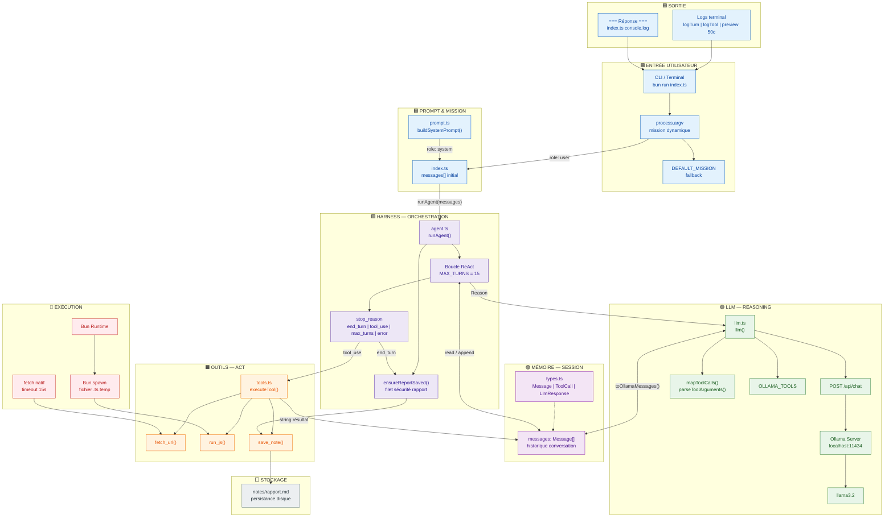
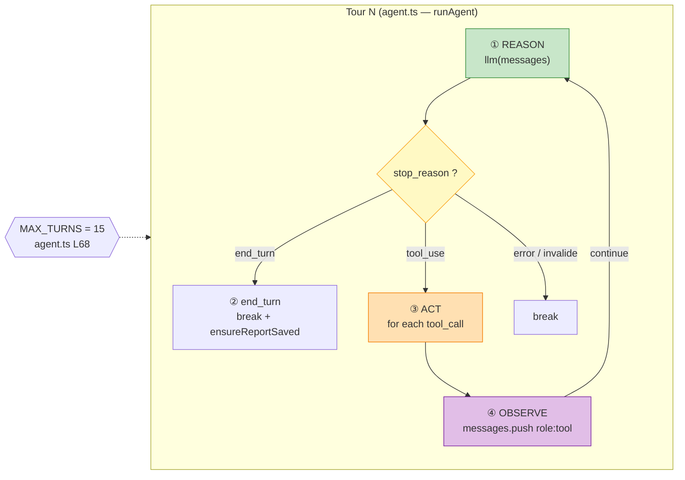
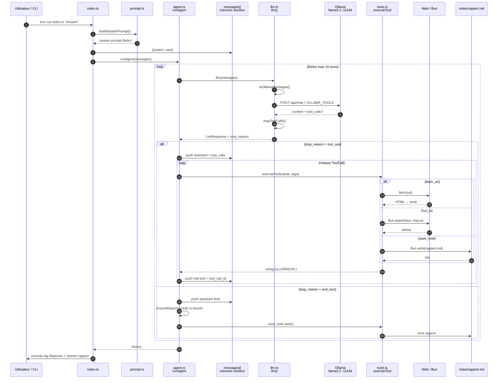
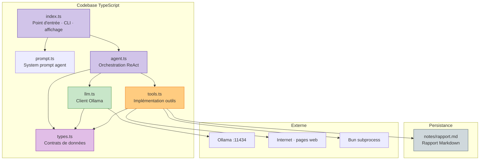

# AI Agent Harness — Architecture (ReAct + Ollama)

> Harness autonome minimal : **Bun + TypeScript + Ollama llama3.2**  
> Style : pipeline IA / orchestration agent (sans LangChain)

---

## 1. Vue pipeline (couches logiques)

---

## 2. Boucle ReAct détaillée (orchestration)

---

## 3. Flux de données (tool calling)

---

## 4. Cartographie fichiers ↔ responsabilités

---

## 5. Gestion interne (erreurs, logs, parsing)

| Composant | Fichier | Fonctions / éléments |
|-----------|---------|----------------------|
| **Types** | `types.ts` | `Message`, `ToolCall`, `LlmResponse`, `StopReason` |
| **Parsing tool_calls** | `llm.ts` | `mapToolCalls()`, `parseToolArguments()`, `toOllamaMessages()` |
| **Logs tours** | `agent.ts` | `logTurn()`, `describeAction()` |
| **Logs outils** | `tools.ts` | `logTool()`, `previewResult()` (50 car.) |
| **Erreurs LLM** | `llm.ts` | timeout, HTTP 404, JSON invalide |
| **Erreurs outils** | `tools.ts` | `ERREUR: ...` retourné en string (pas de crash agent) |
| **Erreurs boucle** | `agent.ts` | try/catch `llm()`, `stop_reason: error` |
| **Limite tours** | `agent.ts` | `MAX_TURNS = 15`, `max_turns` |

---

## 6. Légende des couleurs

| Couleur | Domaine |
|---------|---------|
| Bleu | Entrée / sortie utilisateur (CLI, terminal) |
| Violet | Orchestration harness (boucle ReAct) |
| Violet clair | Mémoire session (`messages[]`) |
| Vert | LLM (Ollama, reasoning, tool selection) |
| Orange | Outils (tool calling, `executeTool`) |
| Rouge | Exécution (fetch, Bun.spawn) |
| Gris | Stockage persistant (`rapport.md`) |

---

## 7. Mémoire : ce qui est persistant vs session

| Donnée | Persistant ? | Où |
|--------|--------------|-----|
| Historique `messages[]` | Non (RAM, une exécution) | `agent.ts` — `runAgent()` |
| Rapport mission | **Oui** (disque) | `notes/rapport.md` via `save_note()` |
| Logs terminal | Non | stdout |
| Modèle Ollama | Oui (disque Ollama) | Hors repo — `~/.ollama` |

**Mémoire persistante métier** = uniquement **`notes/rapport.md`**.  
**Mémoire de travail** = tableau **`messages`** passé à chaque appel `llm()`.

---

## 8. Références code (points d'ancrage)

| Flux | Fichier · Lignes (approx.) |
|------|---------------------------|
| Mission CLI | `index.ts` L17-19 |
| System prompt | `prompt.ts` L2-38 · `index.ts` L22 |
| Lancement boucle | `index.ts` L29 → `agent.ts` `runAgent()` |
| Reason | `agent.ts` L110 · `llm.ts` `llm()` L131 |
| Act multi-outils | `agent.ts` L139-155 · `tools.ts` `executeTool()` L193 |
| Observe / réinjection | `agent.ts` L149-153 · `llm.ts` `toOllamaMessages()` L77 |
| stop_reason | `llm.ts` L184-195 · `agent.ts` L132-160 |
| Rapport auto | `agent.ts` `ensureReportSaved()` L25-65 |
| Ollama endpoint | `llm.ts` L3-4 · L134 |
