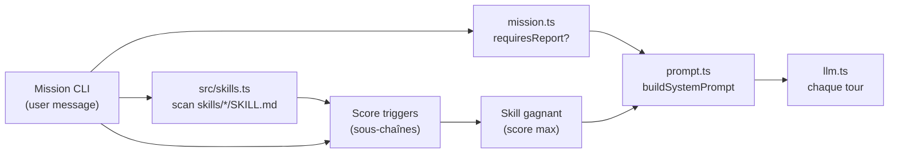
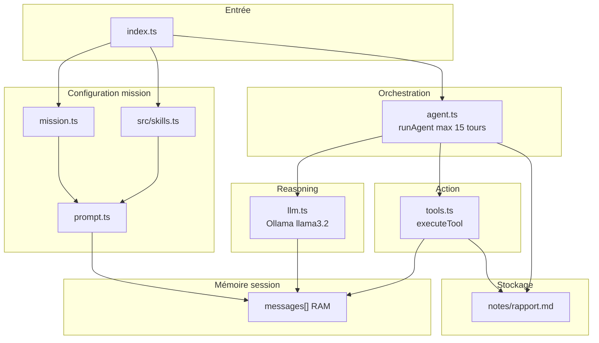
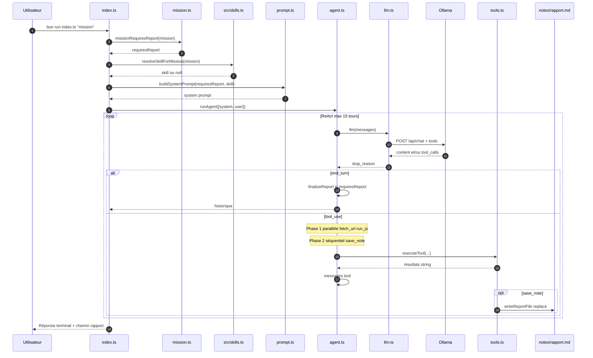
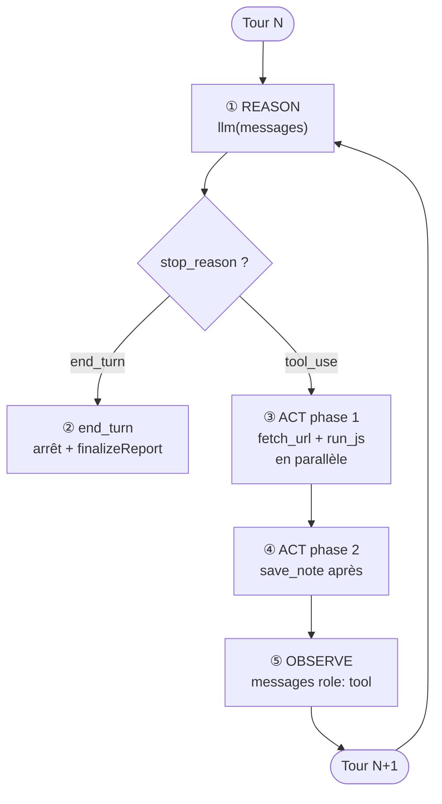

# Guide agent-harness

Documentation du harness ReAct (Bun + TypeScript + Ollama) : architecture, prompts, skills, tests et dernières évolutions.

Voir aussi : [ARCHITECTURE.md](./ARCHITECTURE.md) (diagrammes détaillés par couche).

---

## 1. Dernières améliorations du projet

### 1.1 Exécution parallèle des outils (tour ReAct)

**Fichier :** `agent.ts`

Quand le modèle demande plusieurs outils dans **un même tour** :

| Phase | Outils | Comportement |
|-------|--------|--------------|
| **1** | `fetch_url`, `run_js` | Exécution en **parallèle** (`Promise.all`) |
| **2** | `save_note` (et futurs outils) | Exécution **après** la phase 1, en séquence |

Les messages `role: tool` sont toujours réinjectés dans **l’ordre des `tool_calls`** du modèle (compatibilité Ollama).

**Log exemple :**

```text
  [harness] 2 outils en parallèle: fetch_url, fetch_url
```

**Pourquoi :** réduire la latence sur les missions multi-recherche web, tout en respectant la règle « `save_note` après les recherches ».

---

### 1.2 Rapport fichier unifié (`save_note` = `writeFullReport`)

**Fichier :** `tools.ts`

Avant, deux comportements coexistaient :

- `save_note` → **ajout** de blocs avec `---` dans `notes/rapport.md`
- `writeFullReport` / `finalizeReport` → **remplacement** du fichier

**Maintenant :** une seule fonction interne `writeReportFile` :

- **Remplace** toujours `notes/rapport.md` (en-tête daté + contenu normalisé)
- Messages standardisés :
  - `Rapport écrit : notes/rapport.md`
  - `Rapport inchangé : notes/rapport.md` (contenu déjà présent, pas de réécriture)

**Helpers exportés :**

- `REPORT_WRITTEN_MARKER` / `REPORT_UNCHANGED_MARKER`
- `isReportToolSuccess()` — utilisé par `agent.ts` pour détecter si un rapport a déjà été sauvegardé

**Supprimé :** append avec `---`, messages `Rapport créé`, `Rapport mis à jour`, `Note déjà présente`.

---

### 1.3 Détection rapport plus stricte (`missionRequiresReport`)

**Fichier :** `mission.ts`

Décide si la mission active :

- l’outil `save_note` dans le schéma Ollama ;
- le bloc rapport dans le system prompt ;
- `finalizeReport` / `ensureReportSaved` en fin de mission.

**Activé** (exemples) :

- Mot `rapport`, `notes/rapport`, `save_note`, `rapport.md`
- `rédig` / `redig` **+** `rapport`
- `sauvegard` / `enregistr` **+** (`rapport` ou `notes`)
- `écris` / `ecris` **+** (`rapport` ou `notes/rapport`)

**Désactivé** (exemples — avant souvent activé par erreur) :

- `Calcule moi 10*10.`
- `Fais un audit sécurité de ce code` (sans mot « rapport »)
- `Analyse ce fichier .md` (`.md` seul)
- `Rédige un document structuré` (sans « rapport »)

> **Note :** un skill peut se charger (ex. `tech-report` sur « documentation ») sans que le **rapport fichier** soit activé, si la mission ne contient pas les mots-clés ci-dessus.

---

### 1.4 Tests unitaires (mission)

**Fichier :** `mission.test.ts`  
**Script :** `bun test` dans `package.json`

Couvre la heuristique `missionRequiresReport` (cas positifs / négatifs).

---

## 2. Tests unitaires

### Prérequis

- [Bun](https://bun.sh) installé (le runner de test est intégré à Bun).

### Lancer tous les tests

```bash
bun test
```

Sortie attendue : tous les tests `pass`, 0 `fail`.

### Vérifier les types (sans exécuter l’agent)

```bash
bun run check
```

Équivalent à `bunx tsc --noEmit`.

### Tester manuellement la détection des skills

```bash
bun run test:skills
```

Affiche pour quelques missions quel skill est chargé (`code-review`, `tech-report`, ou aucun).

### Ajouter un test

1. Créer un fichier `*.test.ts` à la racine ou dans `src/` (ex. `mission.test.ts`).
2. Utiliser l’API Bun :

```typescript
import { describe, expect, test } from "bun:test";
import { maFonction } from "./mon-module.ts";

describe("maFonction", () => {
  test("cas nominal", () => {
    expect(maFonction("entrée")).toBe("sortie attendue");
  });
});
```

3. Lancer `bun test`.

**Bonnes cibles pour de futurs tests (sans Ollama) :**

- `normalizeReportContent`, `isReportToolSuccess`
- `parseSkillMd` / `resolveSkillForMission`
- logique de partition des outils parallèles dans `agent.ts` (si extraite)

### Ce que les tests ne couvrent pas encore

- Boucle ReAct complète (nécessite Ollama)
- Appels réels `fetch_url` / `run_js`

Pour une mission bout en bout :

```bash
bun run index.ts "Ta mission"
```

---

## 3. Système de prompt et adaptation aux skills

### 3.1 Deux entrées distinctes

| Message | Source | Rôle |
|---------|--------|------|
| **system** | `buildSystemPrompt(requiresReport, skill)` | Règles ReAct, outils, rapport, **expertise skill** |
| **user** | Argument CLI (`process.argv`) | Mission utilisateur uniquement |

Le skill n’est **jamais** injecté dans le message user : il reste stable à chaque tour `llm()`.

### 3.2 Construction du system prompt (`prompt.ts`)

Le prompt est assemblé en blocs :

```
┌─────────────────────────────────────┐
│  Rôle : agent ReAct (français)      │
├─────────────────────────────────────┤
│  [Optionnel] Expertise active       │  ← skill SKILL.md
│  (skill : code-review, etc.)        │
├─────────────────────────────────────┤
│  Méthode ReAct (3 étapes)           │
├─────────────────────────────────────┤
│  [Optionnel] Bloc rapport fichier   │  ← si missionRequiresReport
│  (save_note, structure Markdown)    │
├─────────────────────────────────────┤
│  Liste des outils                   │
├─────────────────────────────────────┤
│  Règles (fetch_url, run_js, ERREUR) │
└─────────────────────────────────────┘
```

**Variables qui adaptent le prompt :**

| Variable | Déterminée par | Effet sur le prompt |
|----------|----------------|---------------------|
| `requiresReport` | `missionRequiresReport(mission)` | Bloc rapport + ligne `save_note` vs « non disponible » |
| `skill` | `resolveSkillForMission(mission)` | Section `## Expertise active (skill : …)` avec le corps de `SKILL.md` |

### 3.3 Chaîne skill : de la mission au prompt



**Étapes détaillées :**

1. Au démarrage, `index.ts` lit la mission depuis `bun run index.ts "…"`.
2. `resolveSkillForMission(mission)` parcourt `skills/*/SKILL.md`.
3. Chaque skill déclare des **triggers** dans le frontmatter YAML.
4. On compte combien de triggers apparaissent dans la mission (insensible à la casse).
5. Le skill avec le **score le plus élevé** est chargé ; score 0 → aucun skill.
6. `buildSystemPrompt` insère le **corps** du fichier (sans le YAML) dans le system prompt.

**Exemple de frontmatter** (`skills/tech-report/SKILL.md`) :

```yaml
---
name: tech-report
triggers:
  - rapport
  - architecture
  - compare
---
# Skill : Tech Report
…
```

### 3.4 Skills disponibles et déclenchement typique

| Skill | Dossier | Triggers (extraits) | Comportement ajouté au prompt |
|-------|---------|---------------------|-------------------------------|
| **code-review** | `skills/code-review/` | audit, review, sécurité, PR | Priorités review, format critique / majeur / mineur |
| **tech-report** | `skills/tech-report/` | rapport, architecture, compare | Structure rapport technique, sources, synthèse |
| **data-analysis** | `skills/data-analysis/` | données, API, trends | Méthode analyse, hypothèses, limites |

**Indépendance skill / rapport fichier :**

- **Skill** = expertise rédactionnelle dans le system prompt.
- **Rapport fichier** = `missionRequiresReport` + outil `save_note` + `notes/rapport.md`.

Exemple : *« Fais un audit sécurité »* → skill **code-review** probable, **pas** de `save_note` (pas de mot « rapport »).  
Exemple : *« Compare React et Vue et rédige un rapport »* → skill **tech-report** + rapport fichier **oui**.

### 3.5 Outils exposés au modèle (`llm.ts`)

Le schéma Ollama est aussi adapté à la mission :

- Toujours : `fetch_url`, `run_js`
- Si `requiresReport` : `save_note` en plus
- Sinon : `save_note` absent du schéma (le modèle ne peut pas l’appeler via l’API)

---

## 4. Architecture du projet

### 4.1 Vue d’ensemble des fichiers

| Fichier | Responsabilité |
|---------|----------------|
| `index.ts` | Point d’entrée CLI, mission, assemblage messages initiaux |
| `mission.ts` | Heuristique « rapport fichier demandé ? » |
| `src/skills.ts` | Scan skills, parsing YAML, scoring, cache catalogue |
| `prompt.ts` | Construction du system prompt |
| `agent.ts` | Boucle ReAct, parallélisme outils, sync rapport |
| `llm.ts` | Client Ollama, mapping tool_calls, schéma outils |
| `tools.ts` | `fetch_url`, `run_js`, `save_note` / écriture rapport |
| `types.ts` | `Message`, `ToolCall`, `LlmResponse`, `AgentOptions` |
| `skills/*/SKILL.md` | Expertises dynamiques |
| `notes/rapport.md` | Sortie disque (si mission rapport) |

### 4.2 Couches logiques



### 4.3 Mémoire : ce qui persiste

| Donnée | Persistant ? | Emplacement |
|--------|--------------|-------------|
| Historique `messages[]` | Non (une exécution) | RAM, `agent.ts` |
| Rapport mission | Oui (si demandé) | `notes/rapport.md` |
| Logs terminal | Non | stdout |
| Modèle Ollama | Oui (hors repo) | `~/.ollama` |

---

## 5. Schéma du fonctionnement (bout en bout)

### 5.1 Séquence complète



### 5.2 Boucle ReAct (un tour)



### 5.3 Matrice : mission → skill → rapport → outils

| Mission exemple | Skill probable | Rapport fichier | Outils LLM |
|-----------------|----------------|-----------------|------------|
| `Calcule 10*10` | aucun | non | fetch_url, run_js |
| `Audit sécurité ce code` | code-review | non | fetch_url, run_js |
| `Compare React et Vue, rédige un rapport` | tech-report | oui | + save_note |
| `Analyse des données API trends` | data-analysis | non* | fetch_url, run_js |

\* sauf si la mission contient explicitement un mot-clé rapport (`mission.ts`).

---

## 6. Commandes utiles (récapitulatif)

```bash
# Installer
bun install
ollama pull llama3.2

# Lancer l'agent
bun run index.ts
bun run index.ts "Compare React et Vue et rédige un rapport structuré"

# Tests & qualité
bun test
bun run check
bun run test:skills

# Variable optionnelle
OLLAMA_HOST=http://localhost:11434 bun run index.ts "mission"
```

---

## 7. Prochaines évolutions (hors ce guide)

Issues encore ouvertes depuis l’audit initial : sécurité `fetch_url` / `run_js`, budget contexte, registry d’outils, provider LLM abstrait, plus de tests. Voir la discussion d’audit ou `AGENTS.md` pour la feuille de route technique.
